# Architecture

DRY repose sur une separation nette entre le noyau technique et les applications metier.

## 1. Separation des responsabilites

### Kernel: `dry/`

Le kernel contient le framework commun:

- bootstrap HTTP et process
- connexion base de donnees
- middlewares de securite, auth, validation, audit
- factories CRUD et routeurs
- cache, documentation, monitoring, notifications

Regle:

- on n'ajoute pas de logique metier specifique client dans `dry/`

### Business layer: `dryApp/`

Chaque dossier dans `dryApp/` represente une application cliente.

On y place:

- les features metier
- les schemas et controllers propres a l'app
- les routes specifiques au tenant

Regle:

- une app peut configurer ou etendre le comportement framework
- elle ne doit pas modifier le coeur du kernel pour un besoin metier local

## 2. Flux d'une requete

```mermaid
flowchart LR
  A["HTTP request"] --> B["Express app bootstrap"]
  B --> C["Security + CORS + session + request id"]
  C --> D["Bootloader DRY"]
  D --> E["Tenant app router in dryApp/<app>"]
  E --> F["req.getModel(app, schema)"]
  F --> G["Middleware chain auth/validation/cache/audit"]
  G --> H["Controller or CRUD factory"]
  H --> I["Response helper / error handler"]
```



## 3. Multi-tenant runtime

Le serveur demarre une seule fois, puis monte plusieurs apps sous:

```text
/api/v1/<app>
```

Exemples:

- `/api/v1/scim/...`
- `/api/v1/skillforge/...`
- `/api/v1/mediadl/...`

La base technique est partagee, mais chaque app obtient sa propre connexion logique via `getTenantDB()` et ses modeles via `req.getModel(...)`.

## 4. Bootstrap serveur

Le point d'entree `server.js` orchestre maintenant des modules specialises:

- `dry/bootstrap/http.js`
- `dry/bootstrap/routes.js`
- `dry/bootstrap/socket.js`
- `dry/bootstrap/process-handlers.js`
- `dry/bootstrap/health-monitor.js`

But:

- un bootstrap lisible
- moins de couplage
- des tests unitaires plus simples

## 5. Configuration centralisee

La configuration applicative est resolue et validee dans `config/database.js`.

Le serveur refuse maintenant de demarrer si des variables critiques sont absentes ou trop faibles, notamment:

- `MONGO_URI`
- `JWT_SECRET`
- `SESSION_SECRET`

## 6. Core obligatoire vs modules optionnels

Core obligatoire:

- Express
- MongoDB
- auth JWT
- factories CRUD
- documentation Swagger
- gestion d'erreurs

Modules optionnels:

- Redis
- Cloudinary
- Stripe
- Socket.IO
- OAuth providers
- outils media

Cette distinction aide a garder le framework comprehensible et a eviter un noyau trop large.

## 7. Regles de maintenabilite

- toute logique transverse va dans `dry/`
- toute logique metier specifique va dans `dryApp/`
- toute nouvelle variable d'environnement doit etre declaree et validee de facon centralisee
- toute nouvelle feature doit avoir au minimum un test d'integration
- toute evolution du noyau doit viser une couverture unitaire
