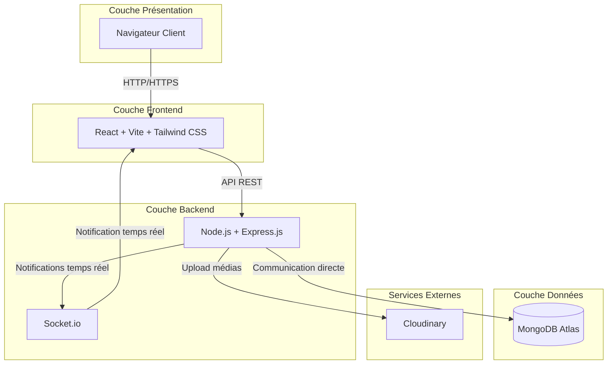
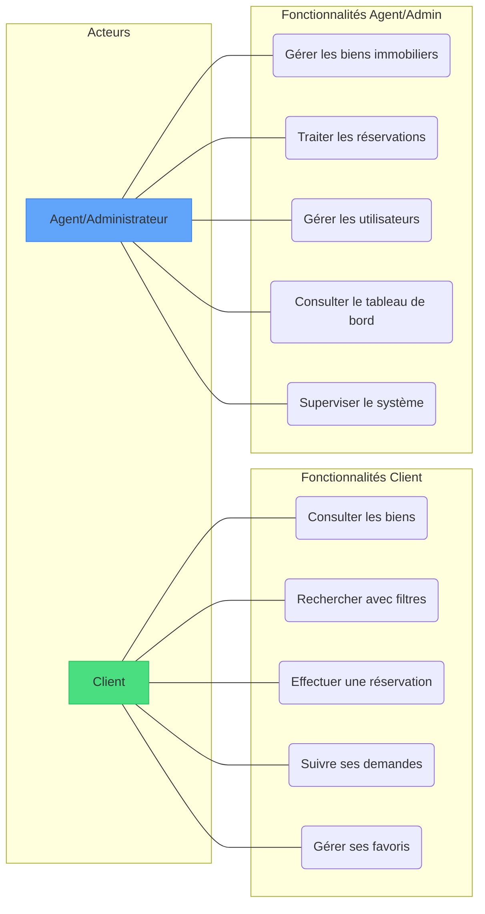
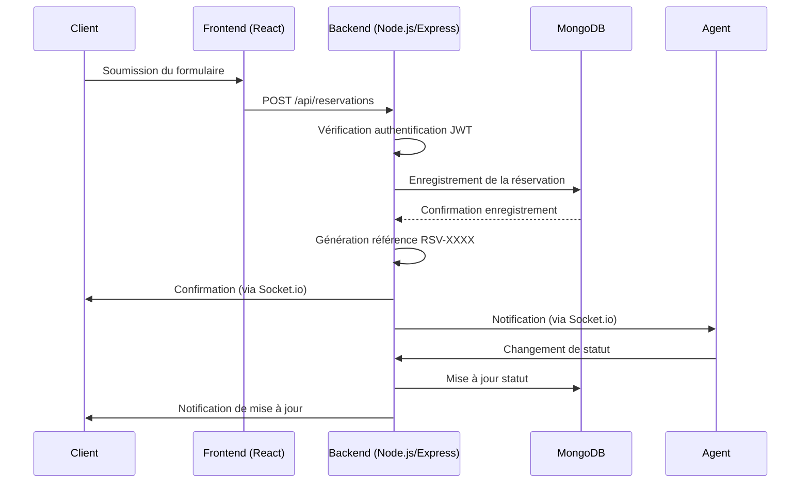
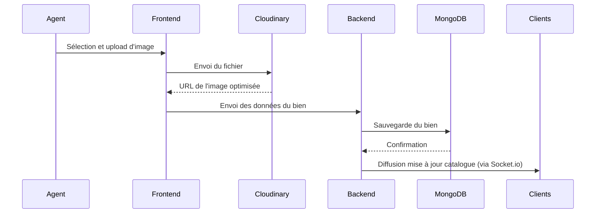
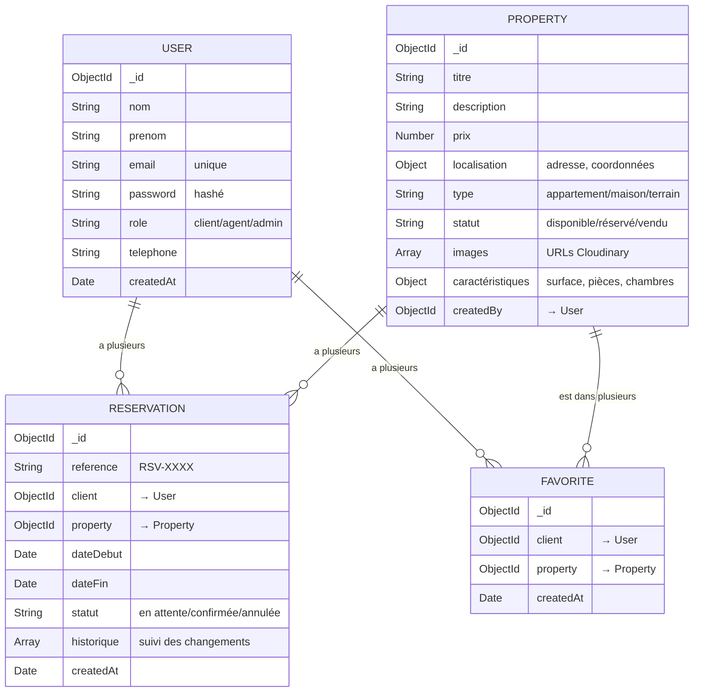
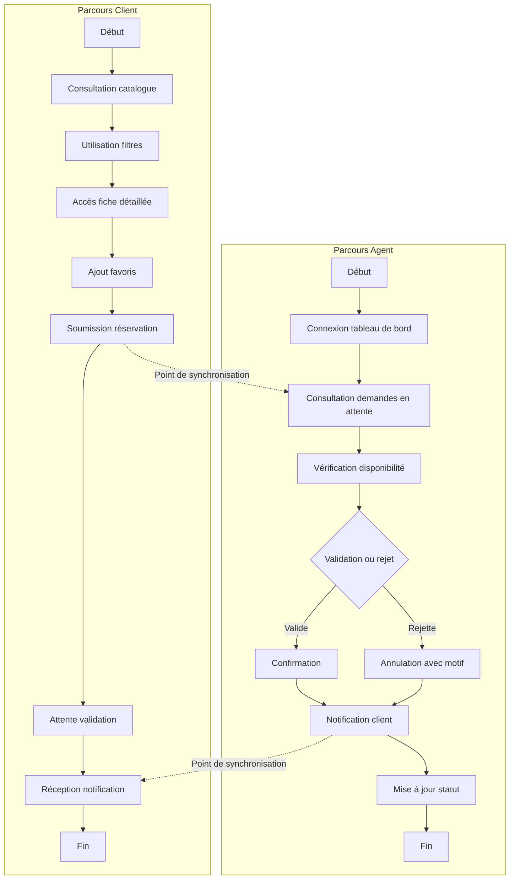
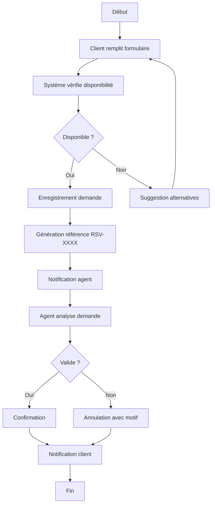
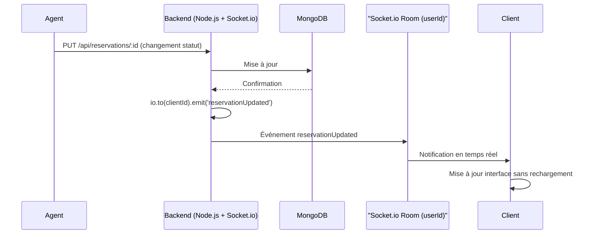
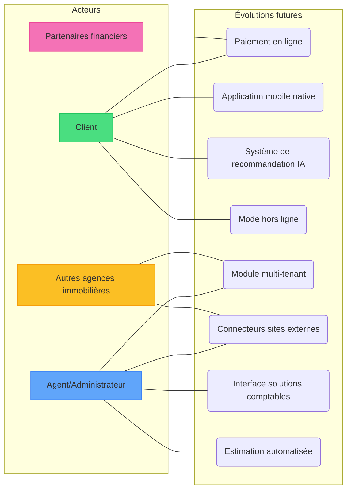

# Diagrammes de la plateforme SCIM

---

## 📥 Comment télécharger les diagrammes

### Méthode 1 : Avec mermaid.live (recommandée)
1. Allez sur [https://mermaid.live/](https://mermaid.live/)
2. Copiez le code Mermaid d'un diagramme
3. Collez-le dans l'éditeur
4. Cliquez sur **Actions** → **Download PNG** ou **Download SVG**

### Méthode 2 : Avec l'extension VS Code
1. Ouvrez le fichier `SCIM_DIAGRAMMES.md`
2. Faites un clic droit sur le diagramme
3. Choisissez **"Open Preview"** ou **"Mermaid: Preview"**
4. Faites une capture d'écran ou utilisez l'option d'export de l'extension

---

## 1. Diagramme d'architecture globale

---

## 2. Diagramme de cas d'utilisation global

---

## 3. Diagramme de séquence - Processus de réservation

---

## 4. Diagramme de séquence - Upload d'image

---

## 5. Diagramme de classes de la base de données MongoDB

---

## 6. Diagramme d'activité - Parcours croisés client et agent

---

## 7. Diagramme d'activité - Processus de création de réservation détaillé

---

## 8. Diagramme de séquence - Flux de notification temps réel via Socket.io

---

## 9. Diagramme d'évolution (cas d'utilisation étendu)

